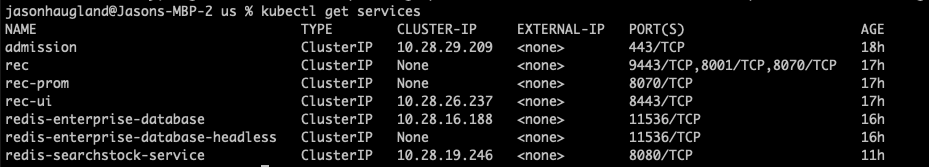

# redisearchStock
A stock ticker solution typeahead solution based on downloaded stock files.  Uses Python redisearch for an API and jquery with bootstrap ajax typeahead plugin.
 


## Outline

- [Overview](#overview)
- [Initial Project Setup](#initial-project-setup)
- [Important Links](#important-linksnotes)
- [Instructions](#instructions)
  - [Create Environment](#create-environment)
  - [Download the datafiles](#download-the-datafiles)
  - [Multiple Deployment options](#multiple-options-for-creating-the-environment)
  - [Docker Compose](#docker-compose-startup)
    - [Prepare the Load](#prepare-the-load)
    - [Start Ticker Load](#start-ticker-load)
  - [Deploy Python on Linux](#deploy-python)
    - [Create python environment](#create-python-environment)
    - [Start Ticker Load on Python](#start-ticker-on-python)
  - [Kubernetes](#kubernetes)
    - [Install Redis Enterprise](#install-redis-enterprise-k8s)
    - [Add Redisinsights](#add-redisinsights)
    - [Deploy application](#deploy-redis-searchstock-on-kubernetes)
    - [Add Memtier Benchmark](#memtier-benchmark)
  - [Use the Application](#use-the-application)
    - [Create Index](#create-index)
- [Cleaning up](#cleaning-up)

## Overview

Uses python to load stock market daily values from download flat files.  Using a redisearch index, a web browser application written in jquery uses typeahead prioritizing stocks with the highest volume to provide type ahead suggestions.  When a stock is selected, more detail is displayed on the stock history.

## Important Links/Notes
* [bootstrap ajax typeahead example](https://github.com/biggora/bootstrap-ajax-typeahead)
* [Redis Stack](https://redis.com/blog/introducing-redis-stack/)
* [Redis Search](https://redis.io/docs/stack/search/)
* [Redis Insight](https://redis.io/docs/stack/insight/)
* [Stooq stock files](https://stooq.com/db/h/)
* [Run Python on k8s](https://opensource.com/article/18/1/running-python-application-kubernetes)
* [k8s persistent volume claim](https://kubernetes.io/docs/concepts/storage/persistent-volumes/#claims-as-volumes)
* [GKE persistent volume claims](https://cloud.google.com/kubernetes-engine/docs/concepts/persistent-volumes)

### Bootstrap ajax typeahead
This plugin is in the repository so not setting is needed.  To learn more-follow the directions in the [bootstrap-ajax-typahead github](https://github.com/biggora/bootstrap-ajax-typeahead)

## Instructions

### Create environment
Clone the github 
```bash 
get clone https://github.com/jphaugla/redisearchStock.git
```

### Download the datafiles
* Download stock files here
 [Stooq stock files](https://stooq.com/db/h/)
* Once downloaded, move the file (it should be a directory called *data*) to the main redisearchStock directory
  * Can combine the various stooq files at the daily level by including world, us, etc under this daily directory
  * There is a separate file for each *stock* or *currency* with a long history of data.  See instructions below for setting the environment variables to limit history load
  * To simplify things, best to remove the spaces in the file directory such as "nasdaq stocks".  The spaces are dealt with in docker-compose but never cleaned this up in k8s.  Just easier to eliminate the spaces.
  
#### Set environment variables

The docker compose file has the environment variables set for the redis connection and the location of the data files.  In k8s, the environment is set in the configmap.
This code uses redisearch.  The redis database must have redisearch installed.  In docker, the redis stack image contains all the modules.   In k8s, redisearch is added in the database yaml file. 
Check the environment variables for appropriateness. Especially check the TICKER_DATA_LOCATION because loading all of 
the US tickers with all of the history can be a lot of data on a laptop.  Here is an explanation of the environment variables.
Modify these values in docker-compose.yml or in the configmap for k8s.  If outside of a container, there is a file created with 
environment variable at scripts/app.env.

| variable             | Original Value | Desccription                                                                                                                                                            |
|----------------------|----------------|-------------------------------------------------------------------------------------------------------------------------------------------------------------------------|
| REDIS_HOST           | redis          | The name of the redis docker container                                                                                                                                  |
| REDIS_PORT           | 6379           | redis port                                                                                                                                                              |
| TICKER_FILE_LOCATION | /data          | leave in /data but can use sub-directory to minimize load size                                                                                                          | 
| PROCESSES            | 6              | On larger machines, increases this will increase load speed                                                                                                             |
| WRITE_JSON           | false          | flag to use JSON instead of Hash structures                                                                                                                    |
| PROCESS_DATES        | true           | have date-based logic instead of just a simple initial load.  Allows for <br/> skipping any records old than a particular date (requires creation of specific redis hash) |   
| PROCESS_RECENTS      | false          | will set most recent flag for specified keys back to false    (requires creation of specific redis set)                                                             |


### Multiple options for creating the environment:  
  * run with docker-compose using a flask and redis container
  * installing for mac os
  * running on linux (probably in the cloud)
  * running on kubernetes (example uses GKE)

### Docker Compose 
Build just needs to be done initially.  NOTE:  if building a new image for k8s, remove a comment to include the copy of the src directory into the image.
```bash
docker-compose build
docker-compose up -d 
```

#### Prepare the load
* If PROCESS_DATES is set, these entries should be made (customize as needed)
  * This will load all the values for 2022 and set the current data to 20220315
  * In k8s, will do next steps using included redisinsight image on port 8001
```bash
docker exec -it redis redis-cli 
hset process_control oldest_value 20220101 current_value 20220414 
```
* If PROCESS_RECENTS is set, set list of recent dates to specifically set the MostRecent flag to false
  * This is needed when loading the next set of values.  E.g.  Current data is 20220315 and want to ensure three previous dates are false for MostRecent.  
```bash
docker exec -it redis redis-cli
sadd remove_current 20220314 20220313 20220312 
```

#### Start Ticker Load
* make sure the TICKER_FILE_LOCATION is good and then start the load
```bash
docker exec -it flask bash -c "python TickerImport.py"
```

Can observe the load progress by watching the load for each file
```bash
docker exec -it redis redis-cli 
hgetall ticker_load
```
  * THIS IS HOW to start flask app server
  * However, it is already running as part of the flask container
 ```bash
docker exec -it flask bash -c "python appy.py"
 ```


### Deploy Python

Can be issues with running flask on linux at the time of installing requirements files
#### create python environment
```bash
cd src
python3 -m venv venv
source venv/bin/activate
```
* Use an environment file for locations
* Need to make sure the data location variables are set correctly
* Can also set the number of concurrent processes for the client using the "PROCESSES" environment variable

```bash
source scripts/app.env
```
#### Start Ticker on Python
* execute python scripts from the src directory
* if trouble with installing requirements, here are some links
[Flask on AWS Linux 2](https://thecodinginterface.com/blog/flask-aws-ec2-deployment/)
[Flask on Ubuntu](https://linuxize.com/post/how-to-install-flask-on-ubuntu-20-04/)
[Flask on RedHat](https://developers.redhat.com/blog/2018/06/05/install-python-flask-on-rhel)
```bash
cd src
pip install -r requirements.txt
python TickerImport.py
```

### Kubernetes
This example is showing GKE steps-adjust accordingly for other versions
#### Install Redis Enterprise k8s
* Get to K8 namespace directory
```bash
cd k8s
```
* Follow [Redis Enterprise k8s installation instructions](https://github.com/RedisLabs/redis-enterprise-k8s-docs#installation) all the way through to step 4.  Use the demo namespace as instructed.
* For Step 5 
  * the admission controller steps are not necessary
  * but the webhook instructions are not necessary
* Don't do Step 6 as the databases for this github are in the k8s subdirectory of this github

##### Create redis enterprise database.
###### Verify cluster is ready
* check health using kubectl
```bash
kubectl get all
kubectl get rec
kubectl get pods
```
* check enterprise node cluster ui (optional steps just for demonstration purposes)
```bash
./getClusterUnPw.sh
```
* port forward so can access the redis cluster 
```bash
kubectl port-forward service/rec-ui 8443
```
* [https://localhost:8443](https://localhost:8443)
##### Create redis database
```bash
kubectl apply -f redis-enterprise-database.yml
```
##### verify database
* check for database in [management ui](https://localhost:8443)
* check database yaml output
* get port and password for database
* port-forward to the database
```bash
kubectl get redb/redis-enterprise-database -o yaml
./getDatabasePw.sh
kubectl port-forward service/redis-enterprise-database 10740
```
* connect to redis-cli - use the password and port from the output of ./getDatabasePw.sh
```bash
redis-cli -p 16379 -a rhliu76
```
* log into redis enterprise node and use rladmin
```bash
kubectl exec -it rec-0 -- bash
rladmin status extra all
```
##### change database
* can make changes to redis database from controller and verify in either rladmin or in the GUI
* use [https://localhost:8443](https://localhost:8443) to view the changes
* modify redis-enterprise-database.yml to enable replication and to increase database size
```bash
edit redis-enterprise-database.yml
kubectl apply -f redis-enterprise-database.yml
```
* will see these changes in the management ui and in rladmin

#### Add redisinsights
These instructions are based on [Install RedisInsights on k8s](https://docs.redis.com/latest/ri/installing/install-k8s/)
&nbsp;
The above instructions have two options for installing redisinights, this uses the second option to install[ without a service](https://docs.redis.com/latest/ri/installing/install-k8s/#create-the-redisinsight-deployment-without-a-service) (avoids creating a load balancer)
* copy the yml file above into a file named *redisinsight.yml* (this file is already in the k8s directory)
* create redisinsights
```bash
kubectl apply -f redisinsight.yml
kubectl port-forward deployment/redisinsight 8001
```
* from chrome or firefox open the browser using http://localhost:8001
* Click "I already have a database"
* Click "Connect to Redis Database"
* Create Connection to target redis database with following parameter entries

| Key      | Value                                     |
|----------|-------------------------------------------|
| host     | redis-enterprise-database.demo            |
| port     | 18154 (get from ./getDatabasepw.sh above) |
| name     | TargetDB                                  |
| Username | (leave blank)                             |
| Password | DrCh7J31 (from ./getDatabasepw.sh above) |
* click ok

#### Deploy redis-searchstock on Kubernetes

* must [log into docker](https://docs.docker.com/engine/reference/commandline/login/) to have access to the docker image
```bash
docker login
```
* modify, create the environmental variables by editing configmap.yml
  * can find the IP addresses and ports for each of the databases by running ```kubectl get services```
  * In the example below the IP address for the REDIS_HOST in the configmap.yaml is *10.28.16.188*

  * get the database password by running ```getDatabasePw```.  Put the returned password the configmap REDIS_PASSWORD 
* apply the configuration map
```bash
cd k8s
kubectl apply -f configmap.yaml
```
* deploy the redis-searchstock
```bash
kubectl apply -f stock.yml
```
* port forward and continue with testing of the APIs
  * NOTE:  get exact name use ```kubectl get pods```
```bash
kubectl port-forward redis-searchstock-c568d9b6b-z2mnf 5000
```

#### Memtier benchmark
Can also optionally deploy memtier benchmark as a pod in the cluster
Before adding memtier.yml, must have extra node and then label the node
```bash
kubectl label nodes gke-jph-k8s-cluster-default-pool-6ecc6b17-zllk app=memtier
kubectl apply -f memtier.yml
```

Use redisinsights or the management UI to observe the benchmark results
## Use the application

### Create Index
There is python running in the flask container (appy.py) listening for API calls.  One of the API calls will recreate the index.  Use the following script to create the index
```bash
cd scripts
./redoIndex.sh
```

Go to the stock type [ahead page](http://localhost:5000) and find the desired stock

These are a group of sample redis-cli queries to see 
```bash
redic-cli -f scripts/searchQueries.txt
```
